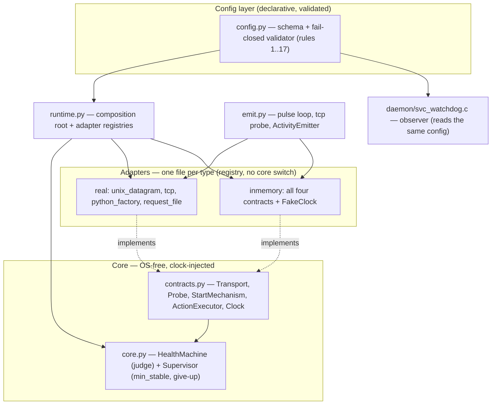
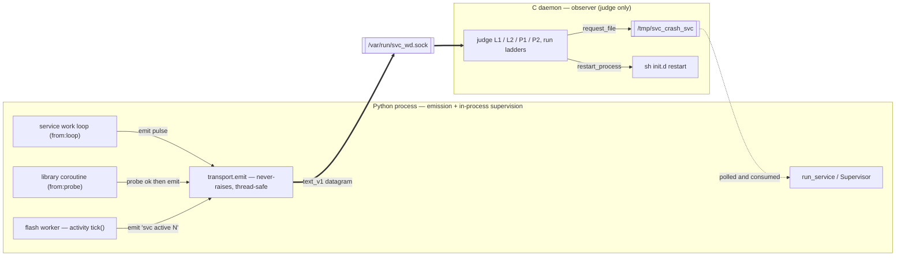
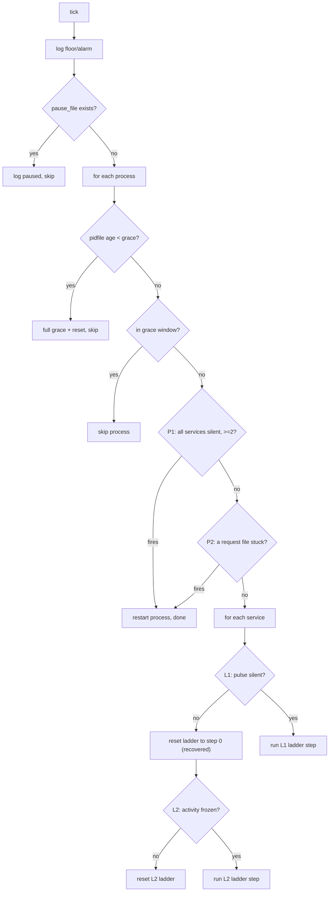
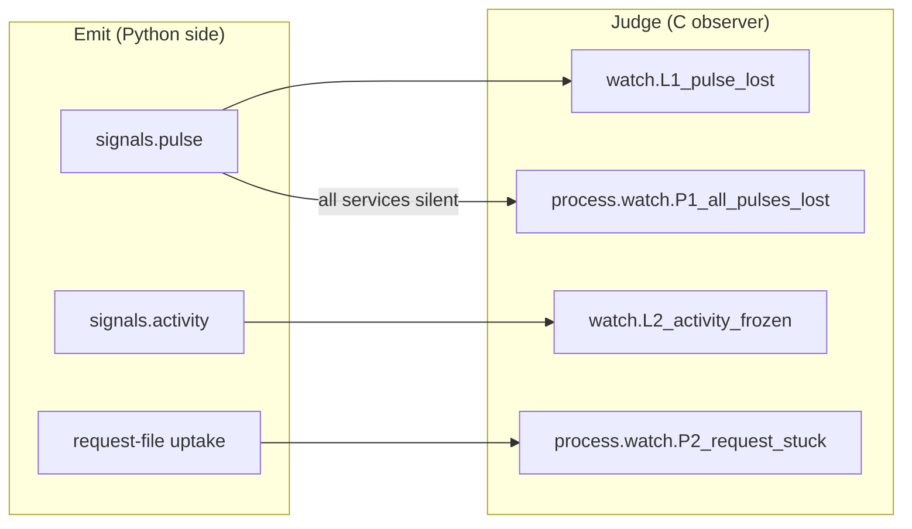
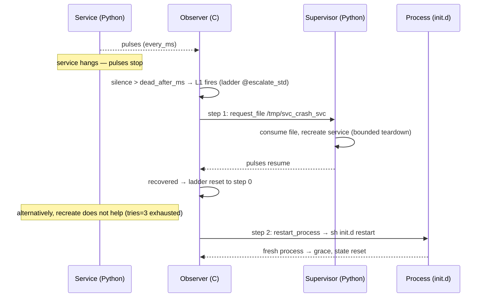
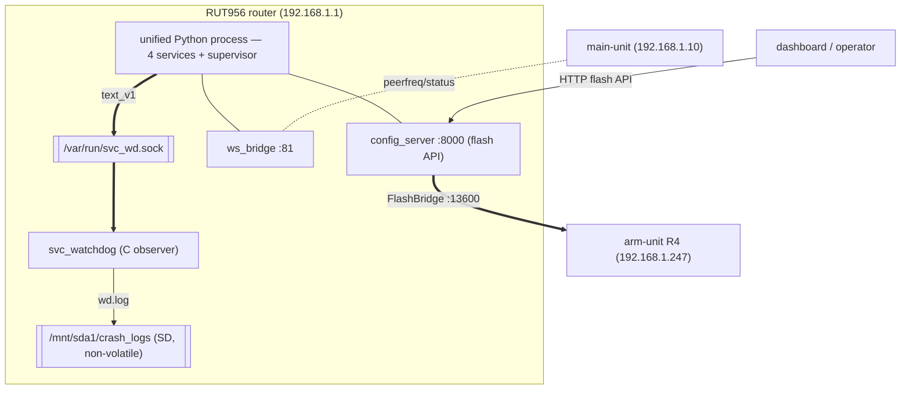

# svc_watch — Architecture

A supervision framework whose behaviour is defined **entirely by one config file**. It has
two runtime sides that read the *same* `svc_watch.conf`:

- the **observer** — a tiny C daemon that judges health and issues actions;
- the **emission / supervision** side — a Python library that services embed to emit
  heartbeats and to run an in-process supervisor.

The core decision machine is **OS-free and clock-injected**, which is what lets the identical
logic run headless in-memory (consumer *B*) and on the real router (consumer *A*).

---

## 1. Components & layers

`core.py` contains no service names, paths, ports, direct `time.*`, or `switch` on adapter
type — verified by grep in the test gate (FR-42/22/41). New behaviour is a new adapter file
plus a `type` string; core and runtime are untouched (FR-40, proven by the extension test).

---

## 2. Two-sided model — emission (Python) ↔ observer (C)

The wire protocol, socket path, and service names are identical between v1.x and v2, so the
observer can be swapped independently — the Python side keeps emitting to the same socket.

---

## 3. Judgment order (per tick — fixed logic, not configurable)

A never-seen service anchors its silence to the process grace anchor, so a service that hangs
before its first pulse is still escalated (C daemon and Python core agree).

---

## 4. Signals ↔ watch levels (paired by name)

`from:"loop"` = the work loop itself sends the pulse; `from:"probe"` = the library sends it
only after a probe (e.g. TCP-connect) succeeds. No signal ⇒ no level, and vice-versa (Rule 5).

---

## 5. Escalation — from silence to recovery / process restart

---

## 6. Deployment topology (the live bench)

During a flash, `config_server` emits an `activity` episode (`active N` → `idle`); the
observer keeps the L2 episode alive as the counter ticks through long operations and does not
false-restart. Proven live: full Bundle-flash R4, `summary=ok`, zero false restarts.

---

See `PROTOCOL.md` for the `text_v1` wire format, `CONFIG_GUIDE.md` for the config contract,
`EMBEDDING.md` for using the library from Python, and `docs/design/` for the rationale.
