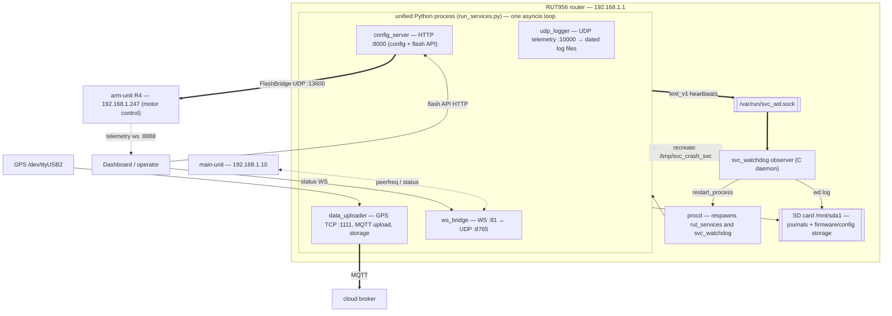
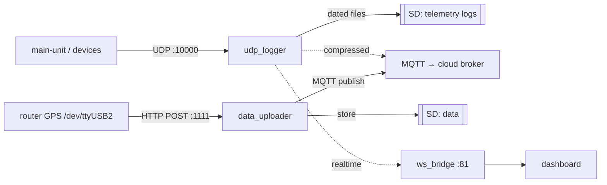
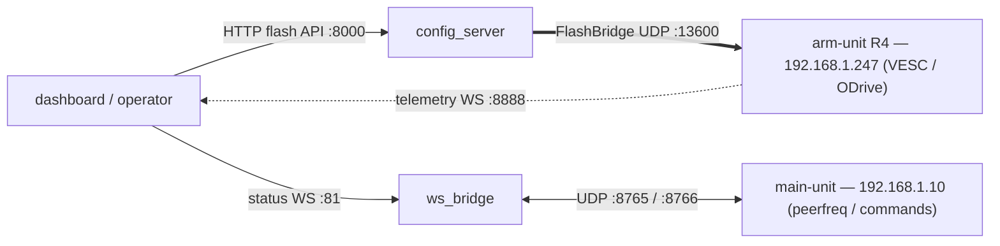
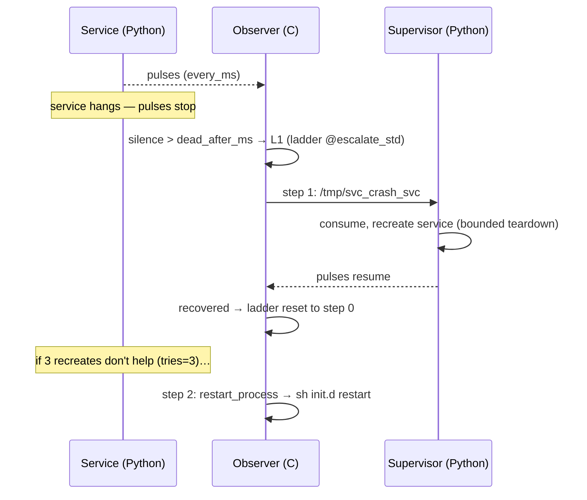

# svc_watch — the RUT956 service supervisor

`svc_watch` keeps the router's Python services alive. **One file, `svc_watch.conf`, is the
single source of truth** for every behaviour: which processes and services exist, how each
proves it is alive, what counts as "dead", and exactly how to escalate. Nothing is hard-coded —
a missing or malformed config refuses to start (fail-closed).

It has two sides that read the same config: a **Python library** (this package) that services
embed to *emit* heartbeats and run an in-process *supervisor*, and a small **C observer**
(`../svc_watch_daemon/`) that *judges* health and *issues actions*.

---

## The whole system



The four services run in **one** Python process (to save RAM). The observer watches all four
over a unix datagram socket; when one goes silent it asks the in-process supervisor to recreate
just that service, and only escalates to a full process restart (via procd) when recreation
does not help.

### Top-level pipelines (what the services actually do)

The heartbeats above are **orthogonal** to the real work: each service also runs its own data or
control pipeline, and those never touch the observer — the observer only sees the liveness pulse,
never the payload. The two main pipelines:

**Telemetry & upload** — ingest data and push it out:



**Control & flash** — configure the box and flash the motor controllers:



`config_server` drives firmware flashing of the arm-unit; the observer tolerates those long flash
operations (see L2 below) without false restarts, but it plays no part in the flash itself.

---

## Install / deploy a new router

Follow `../../installation_guide.md` for the one-time router setup (SD card, SSH key, GPS,
etc.). Then deployment is **upload + one script**:

```sh
# from the repo — ships external-storage-contents to the router and writes /etc/rc.local
python upload.py uploadcode
```

`upload.py` installs `custom-commands.txt` as `/etc/rc.local`, which on every boot runs the
single bring-up script `startup.sh`. That script (idempotent) waits for the SD card, copies the
config to `/etc`, puts the prebuilt observer binary in place, installs the procd init scripts
(`rut_services` for the services, `svc_watchdog` for the observer) and starts them. So a fresh
router just needs the upload and a reboot — or run it once by hand:

```sh
ssh root@192.168.1.1 'sh /usr/local/home/root/external-storage-contents/startup.sh'
```

The observer binary is prebuilt and shipped (`../svc_watch_daemon/svc_watchdog.mipsel`); you
only rebuild it if you change the C source — see `../svc_watch_daemon/BUILD.md`.

---

## Operating modes

Everything is set in the ONE config `svc_watch.conf`, with `enabled` booleans (default `true`) — no deploy
switches, no init.d dance. Two knobs: **each service** `processes.unified.services.<name>.enabled`, and the
**observer** `framework.observer.enabled`. `enabled: false` = not started (Python) and not watched (C); the
block stays, so it flips back easily. `startup.sh` reads the config on every boot, so a mode **survives
reboot by design**. `RD=/usr/local/home/root/external-storage-contents`.

| Mode | services `enabled` | `observer.enabled` |
|---|---|---|
| 1 — everything (default) | all `true` | `true` |
| 2 — services only, no observer | all `true` | `false` |
| 3 — subset + observer | some `false` | `true` |
| 4 — subset, no observer | some `false` | `false` |

Set the flags in `$RD/svc_watch.conf`:
```jsonc
"framework": { "observer": { "enabled": false, ... } }        // Modes 2/4: observer off
"processes": { "unified": { "services": {
    "ws_bridge": { "enabled": false, ... }                     // Modes 3/4: this service off
}}}
```
Then validate + apply (one step — `startup.sh` reconciles services AND the observer to the config):
```sh
python -c "import sys;sys.path.insert(0,'$RD');from svc_watch import config;config.load('$RD/svc_watch.conf');print('OK')"
sh $RD/startup.sh          # applies now  |  or: python upload.py uploadcode (from repo)  |  or just reboot
# verify:
wget -qO- http://127.0.0.1:8000/health ; pgrep -f run_services.py ; pgrep -f svc_watchdog
```

**Turn a service off** — two ways, same effect (not started, not watched): set its `enabled: false` (keeps
the block — recommended) OR remove the block entirely. A ready-to-load one-service config is
`example/configs/svc_watch.single-service.conf`. Down to a single enabled service, drop `P1_all_pulses_lost` from
`processes.unified.watch` (it is inert with one service — the loader only WARNs).

**Add a service** — add a `services.<name>` block (copy `example/add-a-service/service_block.jsonc`); its `start.entry`
factory must exist in `run_services.py`; names globally unique. Validate + apply as above.

**Logs** — supervisor + service tracebacks → `/mnt/sda1/crash_logs/unified.log`
(`processes.unified.supervisor.log.file`); observer actions → `/mnt/sda1/crash_logs/wd.log`
(`framework.observer.log.file`); UDP telemetry → the UDP logger's own dated files (its own config, not here).

---

## The config — structure

`svc_watch.conf` (JSON) has five top-level keys:

```jsonc
{
  "schema": 2,          // config version; anything but 2 is rejected
  "framework": { … },   // machinery: transport, observer, resource gates, pacing
  "actions":   { … },   // catalog of SERVICE-level actions (map: name → action)
  "ladders":   { … },   // catalog of reusable escalation policies (map: name → steps)
  "processes": { … }    // topology: process ⊃ services ⊃ { signals, watch }
}
```

Reading conventions: **the entity name is the left-hand key** (these are maps); **`@` means a
link** to an entity declared elsewhere (checked at load); **meaning comes from the path**. A
process contains services; a service declares what it **emits** (`signals`) and how the observer
**judges** each signal (`watch`). Two optional `enabled` booleans (default `true`) toggle behaviour
without deleting anything — `framework.observer.enabled` (the whole observer) and each
`services.<name>.enabled` (that one service); see "Operating modes".

```jsonc
"processes": {
  "unified": {
    "launch":     { "type": "init_script", "script": "/etc/init.d/rut_services",
                    "pidfile": "/tmp/rut_services.pid",
                    "grace": { "type": "fixed", "ms": 90000 },
                    "restart_rate_limit": { "max": 5, "per_ms": 600000,
                                            "on_exceeded": "cooldown", "cooldown_ms": 300000 } },
    "supervisor": { "poll_ms": 1000, "stop_timeout_ms": 20000, "min_stable_ms": 5000,
                    "max_consecutive_start_failures": 5, "backoff": { … }, "log": { … } },
    "watch":      { "P1_all_pulses_lost": { "mode": "act", "ladder": "@process_only" },
                    "P2_request_stuck":   { "mode": "act", "ladder": "@process_only" } },
    "services": {
      "udp_logger": {
        "enabled": true,   // optional, default true; false = not started nor watched (see "Operating modes")
        "start":   { "type": "python", "entry": "run_services:start_udp_logger" },
        "signals": { "pulse": { "from": "loop", "every_ms": 5000 } },
        "watch":   { "L1_pulse_lost": { "mode": "act", "dead_after_ms": 15000, "ladder": "@soft_only" } }
      },
      "config_server": {
        "start":   { "type": "python", "entry": "run_services:start_config_server" },
        "port":    8000,
        "signals": { "pulse":    { "from": "probe", "every_ms": 5000,
                                   "probe": { "type": "tcp", "port": "@port", "timeout_ms": 2000 } },
                     "activity": { "tick_ms": 2000 } },
        "watch":   { "L1_pulse_lost":      { "mode": "act", "dead_after_ms": 30000, "ladder": "@escalate_std" },
                     "L2_activity_frozen": { "mode": "act", "frozen_after_ms": 60000, "ladder": "@escalate_std" } }
      }
    }
  }
}
```

---

## The config — logic

**Levels — what "dead" means:**

| Level | Scope | Fires when |
|---|---|---|
| `L1_pulse_lost` | service | no pulse for `dead_after_ms` → the loop/listener is dead |
| `L2_activity_frozen` | service | an activity counter is frozen while `active` for `frozen_after_ms` → a worker thread hung |
| `P1_all_pulses_lost` | process (≥2 services) | ALL services silent at once → the process event loop hung |
| `P2_request_stuck` | process | a request file lingers > `eat_within_ms` → the supervisor is dead |

**Signals ↔ watch — paired by name.** A service emits `signals`; the observer judges them via
`watch`: `signals.pulse` ↔ `watch.L1_pulse_lost`, `signals.activity` ↔ `watch.L2_activity_frozen`.
No signal ⇒ no level and vice-versa. **Pulse form:** `from:"loop"` = the service's own work loop
sends the pulse (the send itself proves life); `from:"probe"` = the library sends it only after a
probe (e.g. TCP-connect to `@port`) succeeds — a dead port stays silent and L1 catches it.

**Ladders — how to escalate.** A level points at a ladder (`"@name"`):

```jsonc
"ladders": {
  "soft_only":    [ { "do": "@recreate" } ],                     // recreate the service, forever
  "escalate_std": [ { "do": "@recreate", "tries": 3 },           // 3 recreates without recovery…
                    { "do": "restart_process" } ],               // …then restart the OWNER process
  "process_only": [ { "do": "restart_process" } ]                // straight to process (for P-levels)
}
```
- `"do": "@name"` runs a **service action** from `actions` — `@recreate` drops
  `/tmp/svc_crash_<service>`, which the Python supervisor consumes to recreate the service.
- `"do": "restart_process"` is the **built-in verb**: restart the process that *owns* this
  service (resolved from nesting — you cannot misfire into another process).
- `"tries": N` runs a step up to N times, then advances; the **last** step may omit `tries` (it
  repeats until recovery). A returning pulse / advancing counter resets the ladder to step 0.

**Judgment order (each tick, fixed):** `pause_file? → per process: grace → P1 → P2 → per
service: L1 then L2`. Actions run only when both `framework.observer.mode` and the level's
`mode` are `act` (`log` = observe-only). Every action passes a resource gate (RAM/load) and a
rate limit, so a terminal action backs off into cooldown instead of hammering.

**Validator (fail-closed).** The loader reports **every** problem at once with the key path.
Key rules: unknown key or type = reject; `@`-refs must resolve; `dead_after_ms ≥ 3×every_ms`;
`frozen_after_ms ≥ 20×tick_ms`; service names unique **globally** across processes; a ladder's
non-last step must set `tries`; capacities bounded (≤ 8 processes, ≤ 30 services/process). Run a
config through the validator without starting anything:

```sh
python -c "import sys; sys.path.insert(0,'external-storage-contents'); \
from svc_watch import config; config.load('external-storage-contents/svc_watch.conf'); print('OK')"
```

---

## Extend the config

Both recipes only touch `svc_watch.conf` and your service code; the observer re-reads the config
and needs no rebuild. Copy-paste snippets are in **`example/`**.

### Add a new SERVICE to an existing process

1. Add a `services.<name>` block (see `example/add-a-service/service_block.jsonc`) to that process's `services`
   map — e.g. `processes.unified.services`. It reuses the existing `ladders`. Validate it.
2. Add the factory to that process's composition root (for `unified`, that is
   `../run_services.py`, next to `start_udp_logger` etc.). A `from:"loop"` service **must** send
   its own pulse each iteration:
   ```python
   from svc_watch.adapters.wire import format_pulse
   async def start_telemetry_relay(transport):
       while True:
           relay_one_batch()
           transport.emit(format_pulse("telemetry_relay"))   # proof of life = the send
           await asyncio.sleep(5)                             # ~ every_ms
   ```
3. Keep the service name globally unique (validator rule). Restart the process; test with
   `touch /tmp/wd_test_mute_telemetry_relay` → the observer logs `no_pulse` → `action` →
   `recovered`; then remove the flag.

### Add a whole new PROCESS

1. Add a `processes.<name>` block (see `example/add-a-process/process_block.jsonc` — a `vision` process with
   two camera services). It reuses the existing `ladders`, so `restart_process` targets the new
   process, never `unified`. Validate it.
2. Write its composition root — copy `example/add-a-process/vision_process.py` and fill in the factories. It
   loads the config, builds the transport, and runs each service's pulse + supervise loop.
3. Install its procd init script — copy `example/add-a-process/init.d-newproc.template` → `/etc/init.d/vision`,
   set `PIDFILE` to match `launch.pidfile`, then `enable` + `start`. (Or add the two lines to
   `startup.sh` so it comes up on boot with everything else.)

`example/README.md` walks through both step by step.

---

## How the two sides connect (embedding the library)

On the router the observer is the C daemon; your Python process only emits heartbeats and runs
the supervisor — both from this library, driven by the same config.

```python
import sys; sys.path.insert(0, "/usr/local/home/root/external-storage-contents")
from svc_watch import config, runtime, emit

cfg = config.load("/etc/svc_watch.conf")              # fail-closed; raises WdConfigError on any problem
transport = runtime.build_transport(cfg)               # unix_datagram on the router; never-raising emit

# from:"loop" — the service's own loop sends the pulse:
from svc_watch.adapters.wire import format_pulse
transport.emit(format_pulse("udp_logger"))

# from:"probe" — the library sends the pulse only if a probe passes:
import asyncio
probe = emit.tcp_probe("127.0.0.1", 8000, timeout_s=2.0)
asyncio.ensure_future(emit.pulse_loop("config_server", transport, every_s=5.0, probe=probe))

# activity (L2) — the work code ticks each iteration, idle() in its finally:
activity = emit.ActivityEmitter("config_server", transport, tick_s=2.0)   # activity.tick() … activity.idle()

# supervisor — recreates a service when the observer drops its request file:
sup = runtime.build_supervisor(cfg, "unified", start_mech=None, clock=..., logger=...)
# await runtime.run_service(sup, name, factory, teardown, crash_path=..., stop_event=..., poll_s=..., stop_timeout_s=...)
```

You never call "L1" or "ladder" in code — you emit `signals`; the observer maps them to levels
and ladders exactly as the config declares, and does `restart_process` for you. A full working
composition root (the `BeatBridge` shim + wiring) is in `example/add-a-process/vision_process.py`.



---

## Where the logs go

Two journals on the **SD card** (`/mnt/sda1/crash_logs`, never `/tmp` which is RAM and wiped on
reboot); both paths come from config keys:

- **observer** `wd.log` (`framework.observer.log.file`) — problems the observer saw and actions it
  took; each line carries `up=<monotonic_seconds>` because the router's wall clock jumps.
- **supervisor** `unified.log` (`processes.<p>.supervisor.log.file`, with `fallbacks` for when the
  SD is not yet mounted) — **this is where the services' real-time Python logging lands**: service
  lifecycle and every uncaught exception / traceback a service raises into the supervisor.
  `run_services` attaches a rotating handler for this file to the **root** logger
  (`setup_process_logging`), so any service logger that propagates writes here live.

One deliberate exception: the UDP logger's telemetry stream (`UDPLogger`/`ErrorLogger`) is kept
*out* of `unified.log` — a 20 Hz firehose would churn the `rotate_kb`×`keep` rotation in minutes — so
it writes to its own dated files under the UDP logger's log dir (configured in the UDP logger's own
config, **not** `svc_watch.conf`). A udp_logger *crash* still surfaces in `unified.log` via the
supervisor.

`/tmp` holds only zero-byte flags: crash requests (`/tmp/svc_crash_<service>`), the pause file
(`/tmp/wd_pause`), and test hooks (`/tmp/wd_test_mute_<service>`, `/tmp/wd_test_hang`). Rotation is
`rotate_kb`/`keep`; `fsync` flushes each observer line.

**Operate:** `touch /tmp/wd_pause` pauses the observer; `touch /tmp/svc_crash_<service>`
recreates a service by hand; set `framework.observer.mode` to `"log"` for observe-only.
