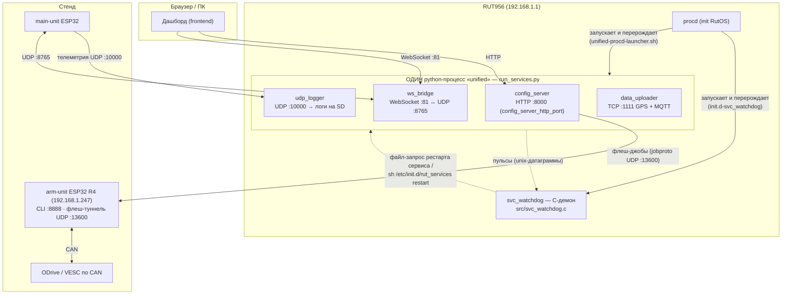
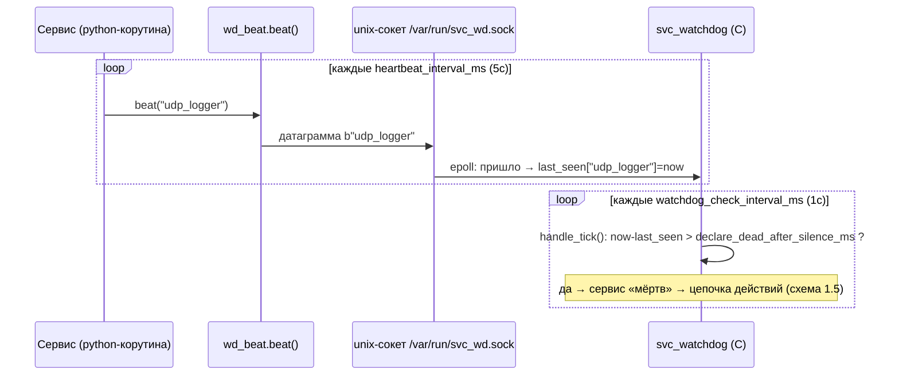
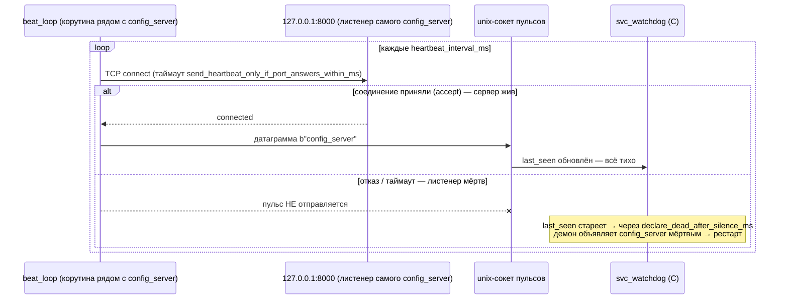
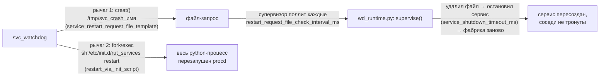
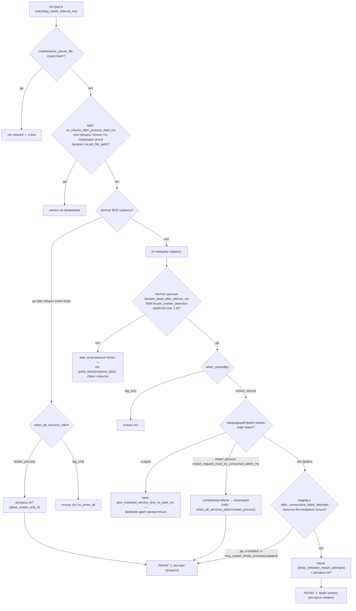
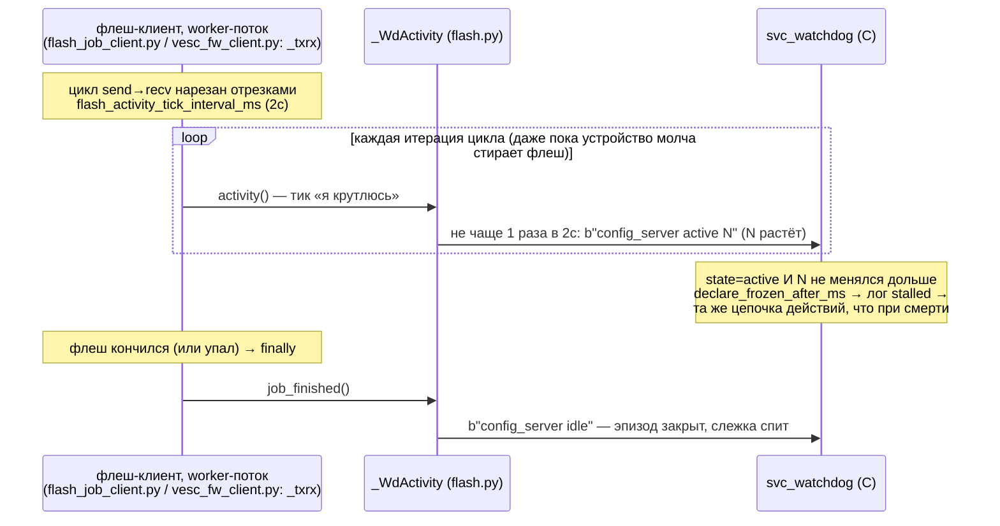

# CONFIG_DRAFT — рабочий черновик /etc/svc_watchdog.conf (итерация 3: имена + архитектура)

> ЧЕРНОВИК ДЛЯ ПРАВКИ. Код пока живёт на старых именах — здесь правим форму,
> после одобрения переношу в парсер C + python + тесты + деплой одним заходом.
> Часть 1 — архитектура (кто, кого, как видит), часть 2 — сам конфиг построчно,
> часть 3 — таблица переименований, часть 4 — границы (другие процессы/сервисы).

---

## Часть 1. Архитектура

### 1.1 Общая схема стенда (где вообще живёт вотчдог)



Реализация: процесс — `external-storage-contents/run_services.py` (только фабрики 4 сервисов),
вся вотчдог-механика python-стороны — `external-storage-contents/wd_runtime.py`,
отправка пульса — `external-storage-contents/wd_beat.py`, демон — `artifacts/watchdog-v1/src/svc_watchdog.c`,
запуск — `external-storage-contents/unified-procd-launcher.sh` + `/etc/init.d/rut_services` (на боксе).

### 1.2 Как демон «видит» сервисы: пульсы (heartbeat)

Единственный канал знания демона о сервисах — **unix-датаграммы** в сокет
`heartbeat_socket_path` (/var/run/svc_wd.sock). **Отправитель** — python-код сервиса
(через `wd_beat.beat(name)`), **получатель** — C-демон: он сидит в epoll на этом сокете
(`svc_watchdog.c: main()` → `handle_datagram()`), на каждую датаграмму обновляет
`last_seen[имя] = сейчас`. Раз в `watchdog_check_interval_ms` таймер будит проверку
(`handle_tick()`): у кого `сейчас − last_seen` больше порога — тот «молчит».
**«Демон видит молчание» = в его таблице у имени устарела метка last_seen. Больше демон не видит ничего** — ни портов, ни процессов, ни HTTP.



Откуда берётся пульс у каждого из 4 сервисов (важно: пульс шлёт **собственный цикл сервиса** — умер цикл, умер пульс):

| Сервис | Кто шлёт пульс | Файл |
|---|---|---|
| udp_logger | его же цикл проверки конфига (каждые 5с внутри 30с-цикла) | `udp_logger/main.py: monitor_config_changes()` |
| data_uploader | его же stall-check-цикл | `data_uploader/main.py` (~стр. 720) |
| config_server | отдельная корутина `beat_loop` С САМОПРОБОЙ (см. 1.3) | `wd_runtime.py: WdRuntime.beat_loop()` + фабрика в `run_services.py: start_config_server()` |
| ws_bridge | та же `beat_loop`, но проба другая — спрашивает у ws-сервера `is_serving()` | `run_services.py: start_ws_bridge()` → `_ws_alive()` |

### 1.3 Самопроба перед пульсом (ответ на «какой порт? кто получает?»)

Проблема, которую она решает (поймана матрицей G3 живьём): у config_server нет
собственного рабочего цикла — HTTP-сервер просто ждёт запросы. Если пульс слать
«просто так» из соседней корутины, возможна ситуация: **HTTP-сервер уже мёртв
(порт 8000 никого не слушает), а корутина-сосед продолжает пульсировать** — демон
считает сервис живым, дашборд получает connection refused. Пульс врёт.

Решение: перед КАЖДЫМ пульсом config_server корутина `beat_loop` сама, **изнутри
того же python-процесса**, делает TCP-connect на **127.0.0.1:`config_server_http_port`**
(= порт 8000 — тот самый порт, на котором HTTP API config_server слушает браузер).
Это не запрос-ответ, просто «примут ли соединение»:



Ответы одним абзацем: **какой порт** — собственный слушающий порт сервиса
(у config_server — 8000); **куда отправляется пульс** — не в порт, а в unix-сокет
`heartbeat_socket_path`; **кто получает** — C-демон svc_watchdog; **почему порт должен
ответить** — потому что это листенер самого сервиса: живой aiohttp-сервер принимает
TCP-соединения всегда, отказ = сервер мёртв; **как демон видит молчание** — по
устареванию last_seen в своей таблице (п. 1.2).

### 1.3a Пульс — услуга библиотеки, настраиваемая из конфига (решение итерации 3)

Претензия принята: сейчас проба ПРОВОДИТСЯ ВРУЧНУЮ в фабрике
(`run_services.py: start_config_server()` сам зовёт `RT.beat_task(..., probe=RT.tcp_probe("127.0.0.1", port))`) —
хочешь пульс с пробой в другом скрипте, копируй проводку. Целевая форма: **вся
настройка пульса живёт в services[].heartbeat конфига, а код сервиса делает один вызов**:

```python
# ЛЮБОЙ python-скрипт (не только run_services.py):
import wd_runtime
rt = wd_runtime.WdRuntime(wd_runtime.load_config(), logger)

task = rt.start_heartbeat("config_server")
#   библиотека сама читает services[config_server].heartbeat из конфига:
#   source=watchdog_library_task → поднимает корутину; какой порт проверять и с каким
#   таймаутом — из того же блока. Ноль проводки в коде сервиса.

task = rt.start_heartbeat("exotic_service", custom_check=my_async_probe)
#   адаптер для проверок, невыразимых портом (кастомная async-функция → bool);
#   в конфиге у такого сервиса заявлено source=watchdog_library_task без порта не бывает —
#   custom_check обязателен, иначе громкий отказ (fail-closed).
```

Следствия для конфига (уже внесены в Часть 2):
- Блок `heartbeat{}` у КАЖДОГО сервиса объявляет источник пульса ЯВНО:
  `"own_work_loop"` (пульс шлёт собственный рабочий цикл сервиса — udp_logger, data_uploader)
  или `"watchdog_library_task"` (пульс ведёт корутина библиотеки — config_server, ws_bridge).
- Порт пробы — из per-service ключа `listen_port`: одна точка истины, её читают
  И фабрика (bind), И библиотечная корутина (проверка). Глобальные
  `python_runtime.config_server_http_port` и `send_heartbeat_only_if_port_answers_within_ms`
  упраздняются — переехали в сервис.
- ws_bridge переводится с кодовой пробы `is_serving()` на ту же конфигову TCP-пробу
  своего порта :81 — проверка даже строже (внешний connect вместо самоотчёта), и оба
  сервиса становятся полностью конфиго-управляемыми.

Лестница проверок одного сервиса (твоя формулировка «это L2 и глубже» — да, это
углубляющиеся уровни доверия к пульсу):

| Уровень | Вопрос | Кто отвечает | Ключ конфига |
|---|---|---|---|
| 0 | процесс жив? | procd (respawn) | — (вне конфига wd) |
| 1 | сервис пульсирует? | демон, таблица last_seen | `heartbeat.declare_dead_after_silence_ms` |
| 1.5 | пульс не врёт? (порт реально принимает) | библиотечная корутина ПЕРЕД отправкой пульса | `heartbeat.send_only_if_port_accepts_within_ms` |
| 2 | рабочий поток не завис? | демон, счётчик тиков | `frozen_worker_detection` |

### 1.4 Канал действий: как демон чинит (файл-запрос и рестарт процесса)

У демона ровно ДВА рычага, оба нарочно тупые:



- Рычаг 1 (мягкий): `svc_watchdog.c: handle_tick()` создаёт файл → `wd_runtime.py: supervise()`
  замечает, гасит сервис через адаптер `run_services.py: _teardown_service()` и зовёт фабрику заново.
- Рычаг 2 (жёсткий): только через init-скрипт, никогда сигналом — иначе гонка с procd.
  Ведут к нему три дороги: все молчат разом (`when_all_services_silent`), файл-запрос никто
  не съел (`restart_request_must_be_consumed_within_ms` — супервизор мёртв), N мягких рестартов
  подряд не вернули пульс (`restart_whole_process_if_service_restarts_dont_help`).

### 1.5 Полное дерево решений демона (каждый тик)



Реализация всего дерева: `svc_watchdog.c: handle_tick()` (числа и режимы — из конфига,
порядок ветвей — компиляция, осознанно).

### 1.6 Уровень 2: слежка за замёрзшим рабочим потоком (frozen_worker_detection)

Зачем: сервис может быть «жив» (event loop крутится, пульсы идут), а его рабочий
ПОТОК — мёртв (флеш завис в deadlock). Базовый пульс этого не видит.



Ключевое разделение ответственности: «устройство молчит» ловят таймауты САМОГО
клиента (он упадёт сам и пошлёт idle из finally) — вотчдог ловит только «поток
перестал исполняться». Счётчик демону непрозрачен: он смотрит лишь «менялся или нет».
Реализация: `config_server/flash.py: _WdActivity` (троттлинг), тики из
`_txrx` обоих клиентов + progress-колбэков + async-поллов `_arm_cli`/`_tcp_up`;
приём 3-го поля — `svc_watchdog.c: handle_datagram()`.

---

## Часть 2. Конфиг построчно (предлагаемые имена)

```jsonc
{
  // ── Транспорт пульсов и базовые периоды ─────────────────────────────────────
  "heartbeat_socket_path": "/var/run/svc_wd.sock",
      // [C+py] unix-сокет пульсов: пишут сервисы (wd_beat.beat), читает демон (epoll). Схема 1.2.
      //        Абсолютный путь короче 108 символов (лимит ядра). tmpfs — нормально, файл нулевой.
  "heartbeat_interval_ms": 5000,
      // [py]   период пульса каждого сервиса. 1000..15000.
      //        Правило: declare_dead_after_silence_ms каждого сервиса ≥ 3× этого (валидатор старта).
  "watchdog_check_interval_ms": 1000,
      // [C]    период проверки таблицы last_seen демоном (схема 1.2). 200..5000.
      //        Меньше = быстрее заметит смерть, чаще просыпается CPU (сейчас 0.08% ядра).
  "maintenance_pause_file_path": "/tmp/wd_pause",
      // [C]    файл существует → демон только пишет "paused" и НИЧЕГО не делает.
      //        Ручной предохранитель: touch = замереть, rm = работать.
  "watchdog_oom_score_adjust": -1000,
      // [C]    приоритет демона для ядерного убийцы памяти. -1000 = не убивать никогда (штатно) .. 0.
  "log_reminder_interval_while_paused_ms": 60000,
      // [C]    стоя на паузе, раз в столько напоминать об этом в лог. 10000..600000.
  "log_interval_for_unknown_service_names_ms": 60000,
      // [C]    пульсы с именем не из services[] логируются не чаще этого (защита от флуда).
      //        1000..600000. Значение 0 = логировать каждую (нужно только тестам ротации).

  // ── Журнал СОБЫТИЙ демона (wd.log: пишет только проблемы и их развязки) ────
  "event_log": {
    "file_path": "/mnt/sda1/crash_logs/wd.log",
        // [C]  обязательно на SD, НЕ /tmp (=RAM): лог должен читаться через неделю и после ребута.
    "rotate_after_bytes": 1048576,       // [C] вырос до этого → переименовать в .1, начать новый. 65536..8388608.
    "rotated_files_to_keep": 7,          // [C] сколько старых хранить (wd.log.1..N). 1..30.
    "flush_every_line_to_disk": true
        // [C]  true = каждая строка сразу на диск (переживает kill -9/OOM/питание).
        //      false = быстрее, но хвост можно потерять. События редки — держим true.
  },

  // ── Python-слой: супервизор сервисов внутри процесса ───────────────────────
  "python_runtime": {
    "service_shutdown_timeout_ms": 20000,
        // [py] при пересоздании сервиса: сколько ждать, пока он остановится и отдаст порты,
        //      прежде чем перестать ждать и продолжить (wd_runtime._bounded_teardown). 5000..60000.
    // (итерация 3: send_heartbeat_only_if_port_answers_within_ms и config_server_http_port
    //  УПРАЗДНЕНЫ здесь — самопроба стала per-service настройкой библиотеки, см. 1.3a
    //  и блоки services[].heartbeat / services[].listen_port ниже.)
    "http_server_connection_close_timeout_ms": 5000,
        // [py] при остановке config_server: ожидание закрытия открытых HTTP-соединений.
        //      1000..15000 (встроенные в aiohttp 60с подвешивали каждый мягкий рестарт).
    "restart_request_file_check_interval_ms": 1000,
        // [py] как часто супервизор проверяет файл-запрос рестарта (схема 1.4). 200..3000.
        //      Правило: сильно меньше restart_request_must_be_consumed_within_ms.
    "flash_activity_tick_interval_ms": 2000,
        // [py] период тика жизни флеш-логики (схема 1.6): троттлинг пульсов со счётчиком И
        //      длина отрезков ожидания в флеш-клиентах (передаётся им параметром). 500..5000.
        //      Правило: declare_frozen_after_ms включённых сервисов ≥ 20-30× этого.
    "restart_backoff": {
        // Пауза супервизора перед пересозданием УПАВШЕГО (исключение в фабрике) сервиса.
        // Растёт с каждым падением подряд; успешный старт сбрасывает.
      "first_delay_ms": 1000,            // [py] после первого падения. 200..5000.
      "growth_factor": 2,                // [py] множитель роста. 1 = не растёт .. 3.
      "max_delay_ms": 10000              // [py] потолок. 5000..60000.
    },
    "runtime_log": {
        // Журнал python-слоя (unified.log): traceback падений, [supervisor] start #N, FATAL конфига.
      "file_path": "/mnt/sda1/crash_logs/unified.log",  // [py] та же папка, что event_log. Не /tmp.
      "rotate_after_bytes": 1048576,     // [py] 65536..8388608.
      "rotated_files_to_keep": 7         // [py] 1..30.
    }
  },

  // ── Условия, при которых рестарты вообще разрешены ─────────────────────────
  "allow_restart_only_if": {
    "free_memory_above_mb": 8,
        // [C]  меньше свободной памяти → с рестартом ждём (сам рестарт стоит ~2-4МБ пиково).
        //      6..15. Должно быть > alarm_when_memory_below_mb.
    "cpu_load_1min_below": 3.0,          // [C] loadavg(1m) выше → ждём. 1.0..10.0 (ядро одно).
    "recheck_interval_ms": 5000,         // [C] шаг перепроверки во время ожидания. 1000..30000.
    "stop_waiting_and_restart_anyway_after_ms": 300000,
        // [C]  прождали дольше → рестартим НЕСМОТРЯ на условия: голодание само не проходит,
        //      а рестарт мёртвого сервиса память обычно освобождает. 60000..900000.
    "alarm_when_memory_below_mb": 5
        // [C]  сигнальная линия в лог ("mem_below_floor"): SSH/модем RutOS под угрозой.
        //      Только сигнал, действий нет. 3..8.
  },

  // ── Пауза между ПОПЫТКАМИ демона по одной и той же цели ────────────────────
  "delay_between_restart_attempts": {
    "strategy": "fixed",
        // [C]  "fixed" = ровный период | "backoff" = растущая пауза. Работает выбранная секция,
        //      обе обязаны присутствовать (fail-closed: ключей-призраков не бывает).
    "fixed":   { "delay_ms": 5000 },     // [C] [fixed] период попыток. 2000..60000.
    "backoff": { "first_delay_ms": 2000, "growth_factor": 2, "max_delay_ms": 60000 }
        // [C]  [backoff] 1000..10000 · 1..3 · 10000..300000. Возврат пульса сбрасывает счёт.
  },

  // ── Управляемый процесс: весь python-стек целиком ──────────────────────────
  "managed_process": {
    "log_display_name": "unified",       // [C] имя процесса в строках лога.
    "restart_via_init_script": "/etc/init.d/rut_services",
        // [C]  ЕДИНСТВЕННЫЙ способ рестарта процесса: sh <скрипт> restart (схема 1.4, рычаг 2).
        //      Демон никогда не шлёт сигналы сам — гонка с procd.
    "pid_file_path": "/tmp/rut_services.pid",
        // [C+sh] пишет launcher (путь берёт ИЗ ЭТОГО ключа через jsonfilter), читает демон:
        //      по возрасту процесса отличает «procd только что переродил — дать время» от
        //      «старый и молчит — действовать». tmpfs — нормально, 5 байт.
    "service_restart_request_file_template": "/tmp/svc_crash_{name}",
        // [C+py] шаблон файла-запроса рестарта сервиса (схема 1.4, рычаг 1). {name} = имя.
        //      tmpfs — нормально, файлы нулевые.
    "restart_request_must_be_consumed_within_ms": 10000,
        // [C]  файл-запрос никто не забрал за это время → супервизор мёртв → эскалация
        //      в рестарт процесса. 5000..30000. Правило: ≫ restart_request_file_check_interval_ms.
    "give_restarted_service_time_to_start_ms": 60000,
        // [C]  запрос забрали → сервису дают столько на запуск, прежде чем трогать снова
        //      (фабрика data_uploader раскручивается ~34с; без окна — ложные эскалации). 30000..180000.
    "no_checks_after_process_start_ms": 90000,
        // [C]  после (ре)старта процесса вообще ничего не проверять: стек грузится.
        //      Покрыть stop(≤10с)+загрузку(~35с)+первый пульс с запасом. 60000..180000.
    "restart_whole_process_if_service_restarts_dont_help": {
        // Страховка (схема 1.5, ветка SOFT): пересоздания идут, пульс не возвращается —
        // внутри процесса что-то не освобождается, лечит только рестарт процесса.
      "enabled": true,                   // [C] false = только лог, процесс не трогать.
      "after_consecutive_failed_attempts": 3   // [C] сколько пересозданий подряд = приговор. 2..5.
    },
    "when_all_services_silent": "restart_process"
        // [C]  ВСЕ молчат разом = завис общий event loop / процесс мёртв.
        //      "restart_process" = боевой | "log_only" = наблюдение (гейтит И обе эскалации:
        //      в log_only демон не рестартит процесс НИКОГДА).
  },

  // ── Реестр сервисов: что поднимать и как за каждым следить ─────────────────
  // Лестница проверок каждого сервиса (см. 1.3a): уровень 1 = пульсирует ли
  // (heartbeat), уровень 1.5 = не врёт ли пульс (проверка порта ПЕРЕД пульсом),
  // уровень 2 = не завис ли рабочий поток (frozen_worker_detection).
  "services": [
    {
      "name": "udp_logger",
          // [C+py] имя = ключ всего: пульс, файл-запрос, строки лога. До 47 символов.
      "python_entry_point": "run_services:start_udp_logger",
          // [py]  "модуль:функция" — фабрика. Новый сервис = блок здесь + его код.
      "heartbeat": {
        "source": "own_work_loop",
            // [py] откуда пульс: "own_work_loop" = его шлёт СОБСТВЕННЫЙ рабочий цикл сервиса
            //      (код сервиса сам зовёт wd_beat.beat; пульс = «мой цикл крутится») |
            //      "watchdog_library_task" = пульс ведёт корутина библиотеки wd_runtime
            //      (для сервисов без своего цикла; тогда обязательны listen_port и
            //      send_only_if_port_accepts_within_ms — см. config_server).
        "declare_dead_after_silence_ms": 15000
            // [C]  тишина дольше → мёртв (схема 1.2). ≥ 3× heartbeat_interval_ms. 15000..60000.
      },
      "when_unhealthy": "restart_service",
          // [C]   "restart_service" = файл-запрос | "log_only" = только фиксировать (обкатка).
      "may_restart_whole_process": false,
          // [C]   право ЭТОГО сервиса на страховку restart_whole_process_...: false у udp_logger —
          //       его пересоздание доказано надёжным. Действует только при глобальном enabled.
      "frozen_worker_detection": { "enabled": false, "declare_frozen_after_ms": 60000 }
          // [C]   уровень 2 (схема 1.6): счётчик тиков рабочего потока замер при active дольше
          //       порога → поток завис → та же цепочка действий. У udp_logger некому тикать —
          //       выключено; порог остаётся записанным. Порог ≥ 20-30× flash_activity_tick_interval_ms.
    },
    {
      "name": "data_uploader",
      "python_entry_point": "run_services:start_data_uploader",
      "heartbeat": {
        "source": "own_work_loop",              // пульс из его stall-check-цикла (data_uploader/main.py)
        "declare_dead_after_silence_ms": 15000
      },
      "when_unhealthy": "restart_service",
      "may_restart_whole_process": true,        // тяжёлый сервис (GPS/MQTT/:1111), история залипаний
      "frozen_worker_detection": { "enabled": false, "declare_frozen_after_ms": 60000 }
    },
    {
      "name": "config_server",
      "python_entry_point": "run_services:start_config_server",
      "listen_port": 8000,
          // [py]  ЕДИНАЯ точка истины порта: фабрика слушает ЕГО (bind HTTP API),
          //       и корутина пульса проверяет ЕГО ЖЕ (уровень 1.5). Было двумя ключами.
      "heartbeat": {
        "source": "watchdog_library_task",
            // пульс ведёт библиотека: у HTTP-сервера нет собственного цикла, слать «просто так»
            // нельзя — пульс врал бы при мёртвом листенере (поймано в G3). Поэтому ↓
        "send_only_if_port_accepts_within_ms": 2000,
            // [py] уровень 1.5 (схема 1.3): перед КАЖДЫМ пульсом TCP-connect на
            //      127.0.0.1:listen_port. Приняли за это время → пульс уходит.
            //      Нет → пульс НЕ шлётся → демон увидит молчание → рестарт.
            //      500..5000, меньше heartbeat_interval_ms.
        "declare_dead_after_silence_ms": 30000
            //      щедрее остальных: event loop занят во время прошивки.
      },
      "when_unhealthy": "restart_service",
      "may_restart_whole_process": true,
      "frozen_worker_detection": { "enabled": true, "declare_frozen_after_ms": 60000 }
          // единственный включённый уровень 2: тики флеш-пути ≤2с даже сквозь erase → запас 30×.
    },
    {
      "name": "ws_bridge",
      "python_entry_point": "run_services:start_ws_bridge",
      "listen_port": 81,
          // [py]  WebSocket-порт моста; проверяется пробой уровня 1.5.
      "heartbeat": {
        "source": "watchdog_library_task",
            // итерация 3: раньше проба была кодовой (is_serving() у ws-сервера) — заменяется
            // той же конфиговой TCP-пробой порта: проверка строже (реальный connect снаружи
            // сервера, а не его самоотчёт) и сервис полностью конфиго-управляем.
        "send_only_if_port_accepts_within_ms": 2000,
        "declare_dead_after_silence_ms": 15000
      },
      "when_unhealthy": "restart_service",
      "may_restart_whole_process": true,
      "frozen_worker_detection": { "enabled": false, "declare_frozen_after_ms": 60000 }
    }
  ]
}
```

---

## Часть 3. Таблица переименований (старое → новое)

| Было | Стало |
|---|---|
| `socket` | `heartbeat_socket_path` |
| `beat_interval_ms` | `heartbeat_interval_ms` |
| `tick_ms` | `watchdog_check_interval_ms` |
| `pause_file` | `maintenance_pause_file_path` |
| `self_oom_adj` | `watchdog_oom_score_adjust` |
| `paused_log_every_ms` | `log_reminder_interval_while_paused_ms` |
| `unknown_name_log_every_ms` | `log_interval_for_unknown_service_names_ms` |
| `log{file,max_bytes,keep,fsync}` | `event_log{file_path, rotate_after_bytes, rotated_files_to_keep, flush_every_line_to_disk}` |
| `python` | `python_runtime` |
| `python.teardown_timeout_ms` | `service_shutdown_timeout_ms` |
| `python.probe_timeout_ms` (глобальный) | `services[].heartbeat.send_only_if_port_accepts_within_ms` (per-service, уровень 1.5) |
| `python.http_shutdown_timeout_ms` | `http_server_connection_close_timeout_ms` |
| `python.crash_poll_ms` | `restart_request_file_check_interval_ms` |
| `python.activity_tick_ms` | `flash_activity_tick_interval_ms` |
| `python.config_server_port` (глобальный) | `services[config_server].listen_port` (per-service; читают и bind, и проба) |
| — (пробы проводились кодом в фабриках) | `services[].heartbeat.source` ("own_work_loop" / "watchdog_library_task") + библиотечный вызов `rt.start_heartbeat(name)` |
| `python.supervise_backoff{initial_ms,factor,max_ms}` | `restart_backoff{first_delay_ms, growth_factor, max_delay_ms}` |
| `python.log` | `runtime_log` (поля как у event_log) |
| `resources` | `allow_restart_only_if` |
| `resources.min_free_mb` | `free_memory_above_mb` |
| `resources.max_load1` | `cpu_load_1min_below` |
| `resources.recheck_ms` | `recheck_interval_ms` |
| `resources.max_wait_ms` | `stop_waiting_and_restart_anyway_after_ms` |
| `resources.rut_floor_mb` | `alarm_when_memory_below_mb` |
| `restart_delay` | `delay_between_restart_attempts` |
| `restart_delay.mode` | `strategy` + подсекции `fixed{delay_ms}` / `backoff{first_delay_ms, growth_factor, max_delay_ms}` |
| `process` | `managed_process` |
| `process.name` | `log_display_name` |
| `process.initd` | `restart_via_init_script` |
| `process.pidfile` | `pid_file_path` |
| `process.crash_file_template` | `service_restart_request_file_template` |
| `process.consume_timeout_ms` | `restart_request_must_be_consumed_within_ms` |
| `process.service_relaunch_ms` | `give_restarted_service_time_to_start_ms` |
| `process.start_grace_ms` | `no_checks_after_process_start_ms` |
| `process.soft_fail_escalation{enabled,after_attempts}` | `restart_whole_process_if_service_restarts_dont_help{enabled, after_consecutive_failed_attempts}` |
| `process.action` ("restart"/"log") | `when_all_services_silent` ("restart_process"/"log_only") |
| `services[].entry` | `python_entry_point` |
| `services[].wait_pulse_timeout_ms` | `heartbeat.declare_dead_after_silence_ms` (внутри блока heartbeat) |
| `services[].action` ("restart"/"log") | `when_unhealthy` ("restart_service"/"log_only") |
| `services[].escalate_to_process` | `may_restart_whole_process` |
| `services[].progress_stall_ms` (0=выкл) | `frozen_worker_detection{enabled, declare_frozen_after_ms}` |

---

## Часть 4. Границы текущей архитектуры: а если процессов станет больше?

Сегодняшнее жёсткое допущение: **все сервисы живут в ОДНОМ управляемом процессе**
(`managed_process` в единственном числе). Что уже готово к нескольким процессам,
а что упрётся:

**Уже готово (менять не придётся):**
- Канал пульсов: сокет один на всех, ключ — ИМЯ сервиса. Датаграмму может слать
  любой процесс (и вообще любой язык — это `sendto()` строки). Демону всё равно, откуда пульс.
- Файл-запрос рестарта: путь строится из шаблона по имени — каждый процесс может
  поллить запросы СВОИХ сервисов.
- Per-service настройки (пороги, действия, L2) — уже по именам, процесса не знают.

**Упрётся (потребует эволюции конфига и ~50-100 строк C):**
- `managed_process` один: один pid-файл, один init-скрипт, одна политика эскалации.
  Для N процессов нужен массив `managed_processes[]`, а каждый сервис должен объявить
  принадлежность: `"belongs_to_process": "unified"`.
- Ветка «молчат ВСЕ» (`when_all_services_silent`) сейчас означает «завис ЕДИНСТВЕННЫЙ
  event loop». При N процессах она обязана считаться ПО ГРУППАМ: молчит вся группа
  процесса X → рестарт X, соседи не тронуты.
- Эскалации (не съели запрос / мягкие не помогли) должны бить в init-скрипт
  ИМЕННО ТОГО процесса, чьему сервису плохо.
- python-супервизор (`wd_runtime.py`) уже библиотека — второй процесс просто импортирует
  её и поднимает свои сервисы из своей части реестра; но валидатор реестра должен
  фильтровать «мои сервисы» по belongs_to_process, а не брать все.

Эскиз конфига под это (НЕ делаем сейчас — фиксируем направление, чтобы нынешние
имена его не заблокировали; полный вариант — бэклог META_LAYER_DRAFT.md):

```jsonc
"managed_processes": [
  { "process_name": "unified", "restart_via_init_script": "/etc/init.d/rut_services",
    "pid_file_path": "/tmp/rut_services.pid", ... },
  { "process_name": "vision",  "restart_via_init_script": "/etc/init.d/vision", ... }
],
"services": [
  { "name": "config_server", "belongs_to_process": "unified", ... },
  { "name": "camera_feed",   "belongs_to_process": "vision",  ... }
]
```

Нынешний рефактор имён этому НЕ противоречит: `managed_process{}` → элемент массива
`managed_processes[]` + ключ `belongs_to_process` у сервисов — миграция чисто аддитивная.
